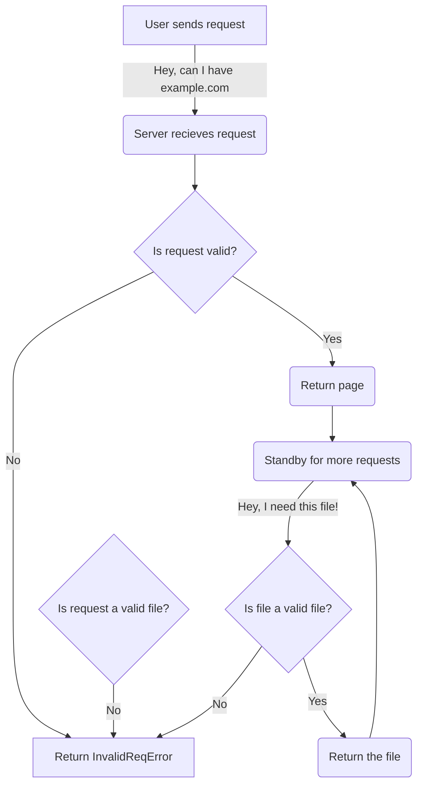

# NootSuite
quick and dirty privacy suite powered by python + flask, deployable in a single touch
## How the fudge does it work?
Look at this nice flowchart of the `PinguHTTP` model

### What are the supported file types?
Quoting form app.py:
```python
sft = [
    # text
    'text/html',
    'text/plain',
    'text/css',
    'text/javascript',
    'text/markdown',
    # image
    'image/png',
    'image/jpeg',
    'image/gif',
    'image/svg+xml',
    'image/webp',
    'image/x-icon',
    # audio
    'audio/mpeg',
    'audio/ogg',
    'audio/wav',
    'audio/webm',
    # video
    'video/mp4',
    'video/ogg',
    'video/webm',
    # application
    'application/javascript',
    'application/json',
    'application/pdf',
    'application/xml',
    'application/zip',    
]
```
### What about other file types?
> Notice: `mkv` will not be supported, as it is a container format, not a file format.
To add support for other file types, you can add them to the `sft` list in `app.py`, then write a parser.
After that, you can add the parser to the `parsers` dictionary in `app.py`.
Example entry:
```python
'application/zip': parse_zip
```
## How do I contribute?
`open a pull request, for god's sake`
If you make enough contributions, you might become a posh collaborator!