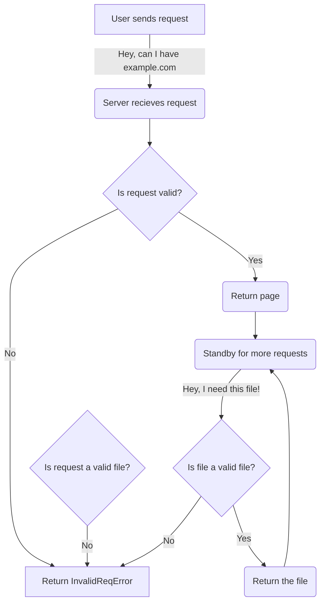

# NootSuite
quick and dirty privacy suite powered by python

```mermaid
flowchart
    a[User sends request] -->|Hey, can I have example.com| b(Server recieves request)
    b --> c{Is request valid?}
    d{Is request a valid file?}
    c -->|No| ire[Return InvalidReqError]
    c --> |Yes| f(Return page)
    d -->|No| ire
    f --> g(Standby for more requests)
    g -->|Hey, I need this file!| e{Is file a valid file?} -->|Yes|h(Return the file) --> g
    e -->|No| ire
```
