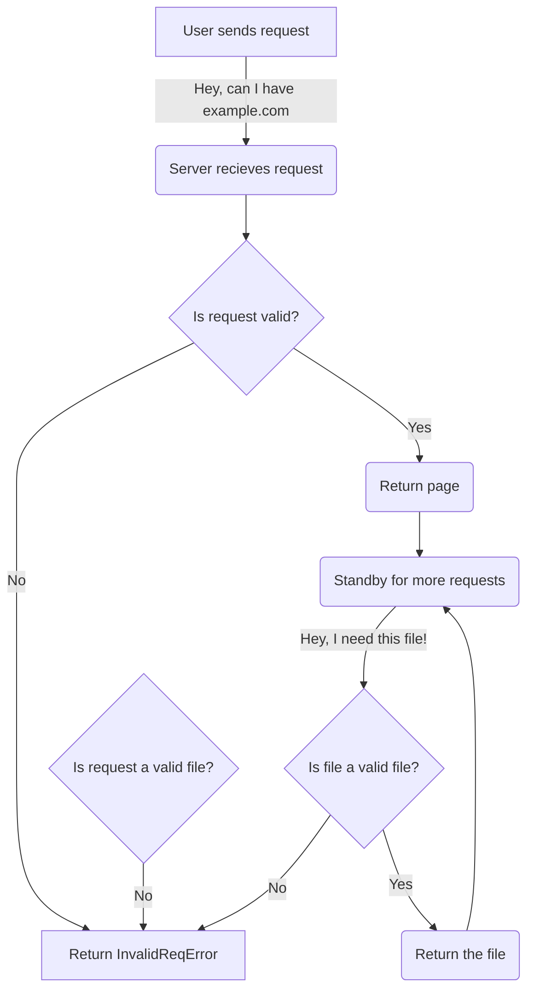

# NootSuite
quick and dirty privacy suite powered by python + flask, deployable in a single touch
## How the fudge does it work?
Look at this nice flowchart of the `PinguHTTP` model

## How do I contribute?
`open a pull request, for god's sake`
If you make enough contributions, you might become a posh collaborator!
